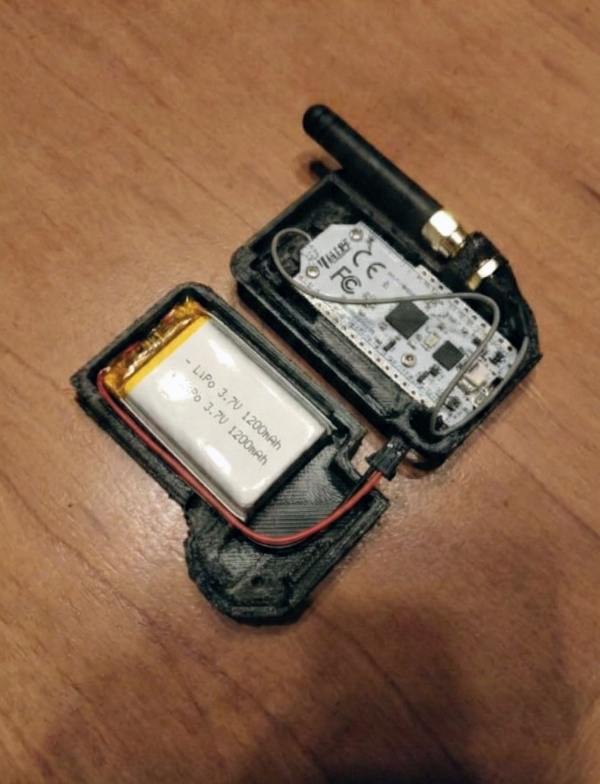
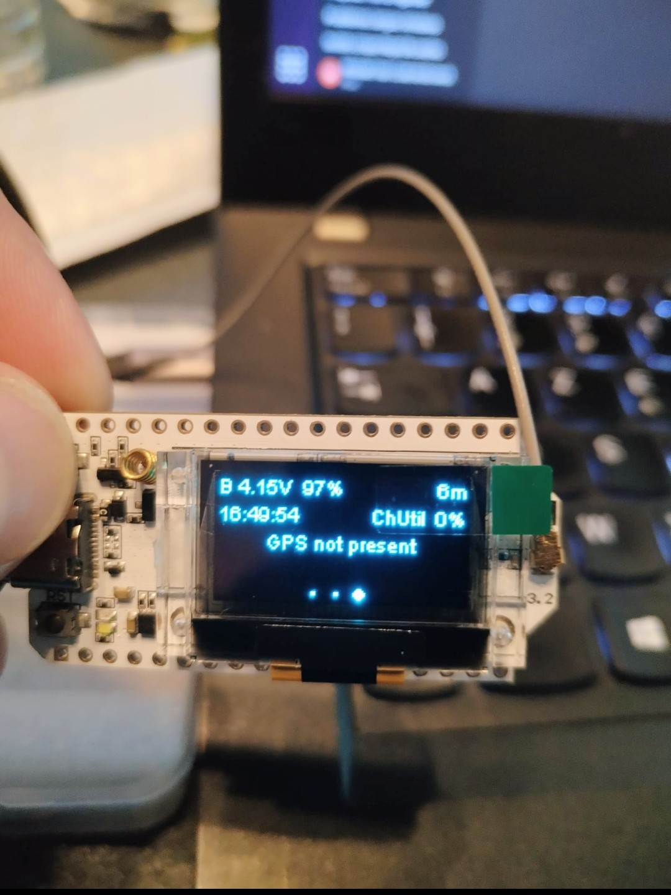
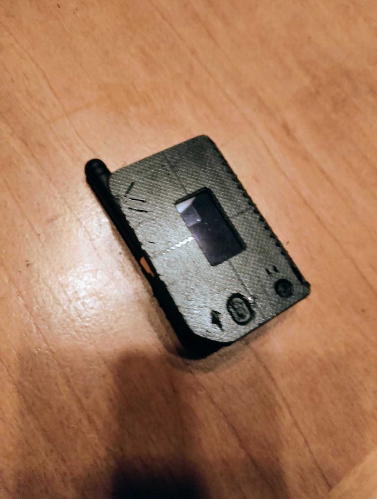

## ⚠️ Tech Migration Disclaimer

> > [!IMPORTANT]This project is currently undergoing a major architectural migration to align with modern industry standards and AI integration requirements.
>
> - **Current Stack:** Laravel 10 (Blade, Eloquent, MySQL).
> - **Future Stack (In Progress):** **Next.js 15** (App Router), **TypeScript**, **Tailwind CSS**, and **Prisma ORM**. This shift aims to improve real-time capabilities, type safety, and seamless integration with AI SDKs.

🌍 Available languages: [English](readme.md) | [Français](/docs/readme_fr.md)

  

<h1 align="center">⛰️ Trek Organizer ⛰️</h1>

  Manage your outdoor activities trekking, climbing, cycling, trail running in a single application.  

## ✨ Features

### 🖥️ Dashboard

- Central home page giving access to all modules.  
- Synthetic view to track the preparation status of an outing.  

---

### 🧰 Gear & backpacks

- Create a **personal gear catalog**.

- Add your equipment item by item: brand, model, weight, volume, price, place of purchase, category.  
- Easily find your items thanks to the search bar and filters (sleep, eat, clothes, hygiene, equipment).  

- Compose several **types of backpacks** from these items:  
  - e.g. backpack for a **long GR**,  
  - backpack for a **winter weekend**,  
  - backpack for a **climbing outing**,  
  - backpack for a **cycling trip**.  

- Each backpack automatically calculates the **total weight** and the **volume**, which makes preparation easier depending on the planned outing.  

Filters allow you to display **the backpack best suited to the planned outing**. For example: a two-day trip with a night in a hut in summer or a five-day trip with bivouac and climbing.  

---

### 🗺️ Itineraries & GPX

- Create **itineraries** (name, dates, location, image, description).  
- Attach **GPX files** to display tracks.  
- Manage your own GPX files.  
- View itineraries on an **interactive map** (fullscreen, ability to enable/disable GPX track).  

Access a library of **GPX files shared** by the community.  

---

### 🌤️ Weather

- Save your **favorite places**.  
- Geocoding via **Google Maps**.  
- Reliable forecasts via **Open-Meteo** (daily & real time).  

---

### 📰 News

- Outdoor news feed.  

---

### 💬 Forum

- A simple space to keep notes, share ideas or prepare an outing with others.  

---

### 💸 Budgets

- Create **budgets per outing/project**.  
- Add **participants**.  
- Record **transactions** (amount, type, user, budget).  
- Share **expenses** among participants.  

---

## 🛰️ Hardware Integration: LoRa Mesh Network

Trek Organizer extends beyond the web with custom-built hardware tags based on **ESP32** and the **LoRa (Long Range)** protocol.

These tags are designed for "white zones" (areas without cellular coverage), creating a local mesh network between trekkers to ensure safety and connectivity.

<table align="center">
  <tr>
    <td align="center"></td>
    <td align="center"></td>
    <td align="center"></td>
  </tr>
  <tr>
    <td align="center"><em>Fig 1. Prototype internals showing the ESP32 LoRa board and 1200mAh LiPo battery inside a custom 3D printed case.</em></td>
    <td align="center"><em>Fig 2. Close-up of the OLED display showing device status during initial testing.</em></td>
    <td align="center"><em>Fig 3. Final assembled prototype ready for field testing.</em></td>
  </tr>
</table>

### Key Hardware Features:
* **Offline Connectivity:** Enables communication (chat) and location sharing between devices without relying on telecom infrastructure.
* **Safety First:** Includes a decentralized SOS alert system.
* **Data Mule Architecture:** The tags collect environmental data offline. This data is buffered and synchronized to the main Trek Organizer platform via the smartphone’s gateway once a connection (Wi-Fi/4G) is restored.

---

## 🧠 AI & Data Science Vision

The project aims to evolve from a management tool into an intelligent assistant and a scientific data provider.

> > [!NOTE]
> > **AI Study Phase:** The concepts outlined below represent the long-term vision for the project. I am currently in the study phase regarding Artificial Intelligence technologies. These features and their implementation details will likely evolve significantly as I deepen my knowledge in this field during my upcoming training.

### 1. Edge AI (TinyML)
* **Fall Detection:** Running lightweight neural networks directly on the ESP32 microcontroller to distinguish between normal hiking movements and accidental falls, triggering automatic alerts.
* **Smart Power Management:** Using predictive models to optimize battery life based on usage patterns and environmental conditions.

### 2. Citizen Science & Environmental Data
By turning every trekker into a mobile sensor station, we aim to bridge the data gap in remote areas.
* **Micro-Climate Mapping:** Collecting temperature, humidity, and pressure data from thousands of points on trails to provide high-resolution data for climate researchers.
* **Anomaly Detection:** Using machine learning (e.g., Isolation Forests) to clean noisy sensor data and identify environmental anomalies like early-stage wildfires.

### 3. Predictive Analytics
* **Personalized ETA:** An AI engine that learns from a user's real-world pace across different terrains to predict arrival times more accurately than standard calculators.

------

## ⚙️ Back-end

- **Framework**: [Laravel 10](https://laravel.com/)  
- **Database**: SQL.  
- **Data management**: Eloquent.  
- **Auth**: Laravel Breeze (login, registration, profile).  
- **Front-end**: Blade.  

---

## 🗺️ Roadmap & Evolution

The project is structured in three main phases, moving from a management tool to an intelligent, data-driven ecosystem.

### Phase 1: Technical Foundation & Migration (Current)
* [ ] **Full Migration to Next.js 15:** Transitioning from Laravel to a modern React-based stack for better performance and AI SDK integration.
* [ ] **Core Modules Enhancement:** Finalizing the Gear, Budget, and GPX management systems with TypeScript for maximum reliability.
* [ ] **PWA Implementation:** Enabling offline consultation and data caching for use in remote areas.

### Phase 2: Hardware & Connectivity (Mid-term)
* [ ] **LoRa Mesh Integration:** Finalizing the bridge between the ESP32 tags and the web platform via Bluetooth/WebSerial.
* [ ] **Data Mule Protocol:** Implementing the background synchronization of environmental data from the tags to the cloud.
* [ ] **Interactive Maps:** Multi-GPX visualization with dynamic elevation profiles and real-time mesh node positioning.

### Phase 3: Intelligence & Science (Long-term / AI Study)
* [ ] **AI Assistant v1:** Smart gear recommendation engine based on weather forecasts, trail difficulty, and user inventory.
* [ ] **Edge AI Deployment:** Implementing TinyML models on the ESP32 for autonomous fall detection and SOS triggering.
* [ ] **Predictive ETA Engine:** Machine Learning model to calculate personalized arrival times based on historical user pace and terrain.
* [ ] **Open Science API:** Launching a public portal for researchers to access anonymized micro-climate data collected by the community.
* [ ] **Multilingual Support:** Expanding the platform for international trekking communities.