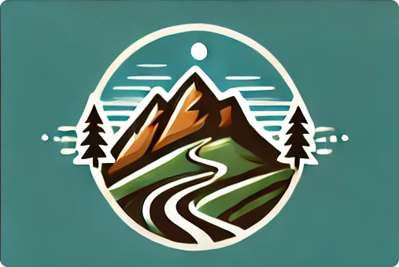
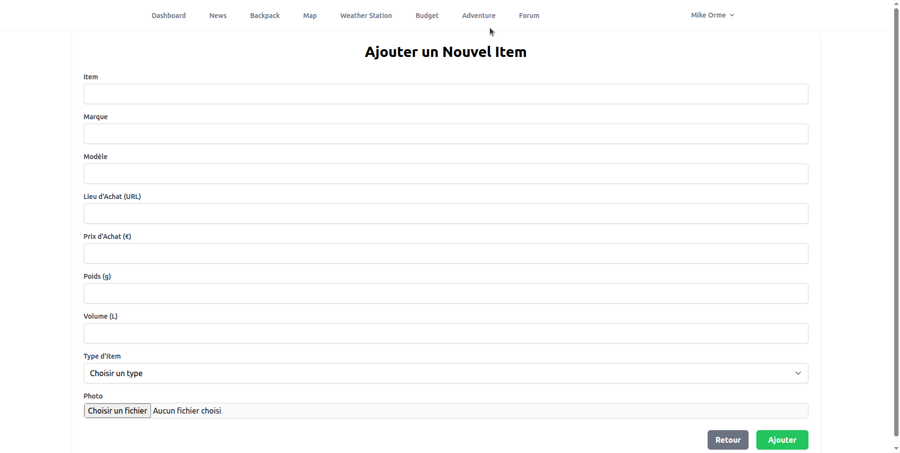

🌍 Available languages: [English](readme.md) | [Français](/docs/readme_fr.md)

  

<h1 align="center">⛰️ Trek Organizer ⛰️</h1>

  Manage your outdoor activities trekking, climbing, cycling, trail running in a single application.  

---

## ✨ Features

### 🖥️ Dashboard

- Central home page giving access to all modules.  
- Synthetic view to track the preparation status of an outing.  

---

### 🧰 Gear & backpacks

- Create a **personal gear catalog**.

- Add your equipment item by item: brand, model, weight, volume, price, place of purchase, category.  
- Easily find your items thanks to the search bar and filters (sleep, eat, clothes, hygiene, equipment).  

- Compose several **types of backpacks** from these items:  
  - e.g. backpack for a **long GR**,  
  - backpack for a **winter weekend**,  
  - backpack for a **climbing outing**,  
  - backpack for a **cycling trip**.  

- Each backpack automatically calculates the **total weight** and the **volume**, which makes preparation easier depending on the planned outing.  

Filters allow you to display **the backpack best suited to the planned outing**. For example: a two-day trip with a night in a hut in summer or a five-day trip with bivouac and climbing.  

---

### 🗺️ Itineraries & GPX

- Create **itineraries** (name, dates, location, image, description).  
- Attach **GPX files** to display tracks.  
- Manage your own GPX files.  
- View itineraries on an **interactive map** (fullscreen, ability to enable/disable GPX track).  

Access a library of **GPX files shared** by the community.  

---

### 🌤️ Weather

- Save your **favorite places**.  
- Geocoding via **Google Maps**.  
- Reliable forecasts via **Open-Meteo** (daily & real time).  

---

### 📰 News

- Outdoor news feed.  

---

### 💬 Forum

- A simple space to keep notes, share ideas or prepare an outing with others.  

---

### 💸 Budgets

- Create **budgets per outing/project**.  
- Add **participants**.  
- Record **transactions** (amount, type, user, budget).  
- Share **expenses** among participants.  

---

## ⚙️ Back-end

- **Framework**: [Laravel 10](https://laravel.com/)  
- **Database**: SQL.  
- **Data management**: Eloquent.  
- **Auth**: Laravel Breeze (login, registration, profile).  
- **Front-end**: Blade.  

---

## 🗺️ Roadmap

- **Exports PDF/CSV (gear list, itinerary plan)**  
- **Multi-GPX visualization with elevation profiles**  
- **Develop the social part** (friends, sharing, comments, public profiles)  
- **Front-end redesign: Livewire / Vue**  
- **Multilingual**  
- **Real-time collaboration on budgets/itineraries**  
- **Assistant**: propose a backpack according to location/season/weather + owned gear  
- **PWA for offline consultation**
